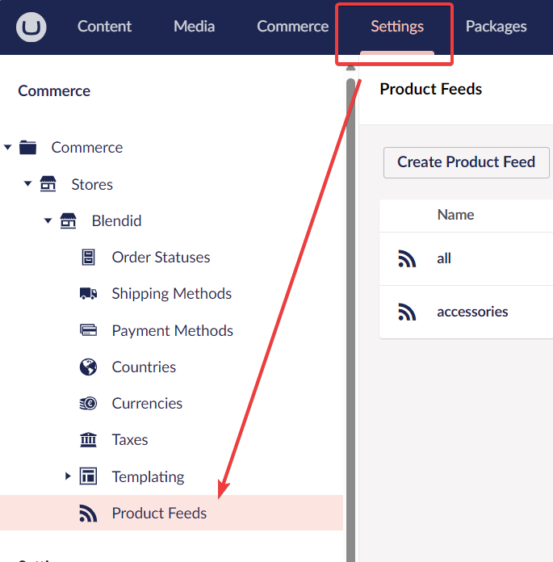
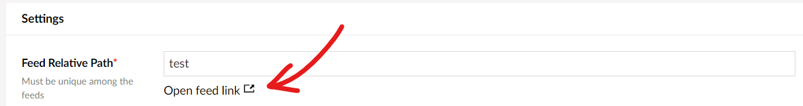
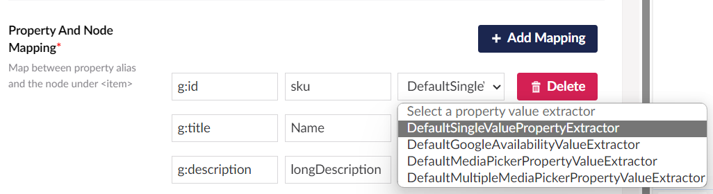

# Getting started

## Basic usage
- Install the package from nuget: [](https://www.nuget.org/packages/Umbraco.Commerce.ProductFeeds/) 

- When you call `IUmbracoBuilder.AddUmbracoCommerce()`, call `IUmbracoCommerceBuilder.AddCommerceProductFeeds()` to add this plugin to your website.

```cs
        umbracoBuilder.AddUmbracoCommerce(ucBuilder => {
            ucBuilder.AddCommerceProductFeeds(); // this line
        }
```
- Go to your backoffice, open your store's setting page then click on `Product Feed` link.
.

- From `Product Feeds` page, click on `Create Product Feed` button and fill in the feed settings. Mandatory fields are marked with a red asterisk (*).


- After saving the feed setting, you can find the feed link under `Feed Relative Path` field.


## Extending the plugin

### Add a custom property value extractor
When a simple node-name-to-property-alias mapping does not suit your need, you can create your own property value extractor to... *extract* the value from the property yourself.

Most of the time, you just need to create a new implementation of `ISingleValuePropertyExtractor` ~~or rarely `IMultipleValuePropertyExtractor`~~.

This plugin uses [Collection Builder pattern](https://docs.umbraco.com/umbraco-cms/implementation/composing#example-modifying-collections) which is commonly used in Umbraco. You can use these two extension methods during application initialization to add your value extractors.

```c#
// IUmbracoBuilder builder;
builder.SingleValuePropertyExtractors()
    .Append<DefaultSingleValuePropertyExtractor>()
    .Append<DefaultGoogleAvailabilityValueExtractor>()
    .Append<DefaultMediaPickerPropertyValueExtractor>();

builder.MultipleValuePropertyExtractors()
    .Append<DefaultMultipleMediaPickerPropertyValueExtractor>();
```

Afterwards, your extractor name should show up in the dropdown under `Property And Node Mapping` section.
