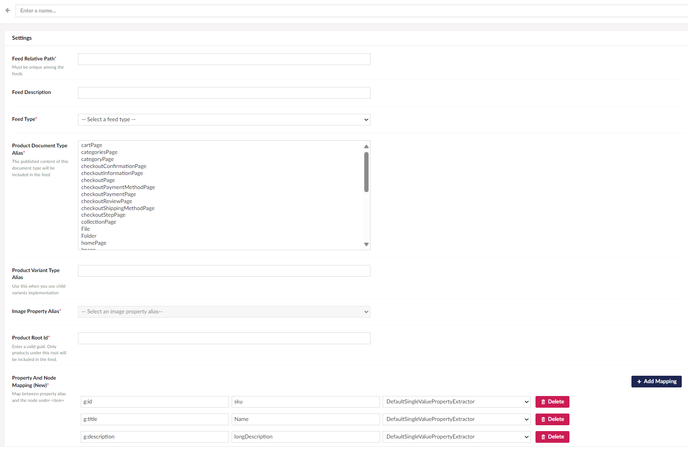

# Getting started
- Install the package from nuget: [](https://www.nuget.org/packages/Umbraco.Commerce.ProductFeeds/) 

- In your `Startup.cs` file, call `IServiceCollection.AddCommerceProductFeeds()` in `ConfigureServices` method

```cs
        public void ConfigureServices(IServiceCollection services)
        {
methods
            services.AddUmbraco(_env, _config)
                .AddBackOffice()
                .AddWebsite()
                .AddDemoStore()
                .AddComposers()
                .AddCommerceProductFeeds() // <====== this line
                .Build();
        }
```
- Go to your backoffice, open your store's setting page then click on `Product Feed` link.
.

- From `Product Feeds` page, click on `Create Product Feed` button and fill in the feed settings. Mandatory fields are marked with a red asterisk (*).
